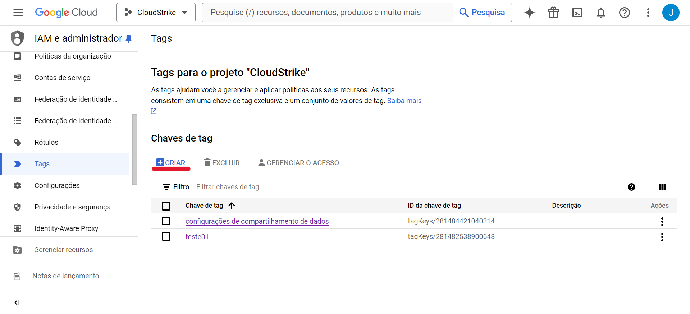
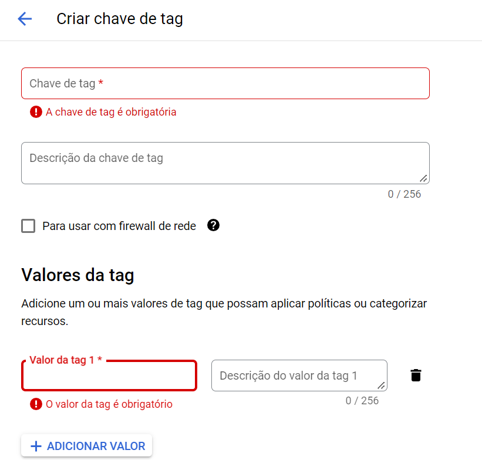
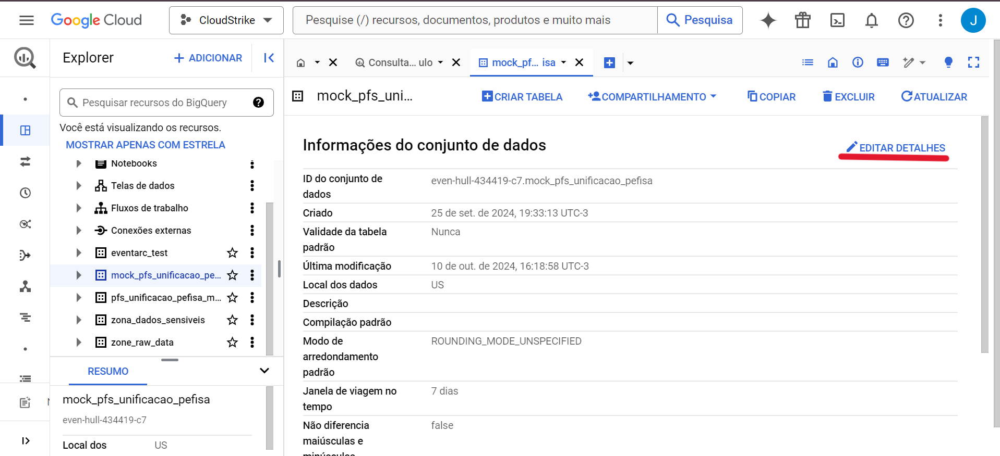
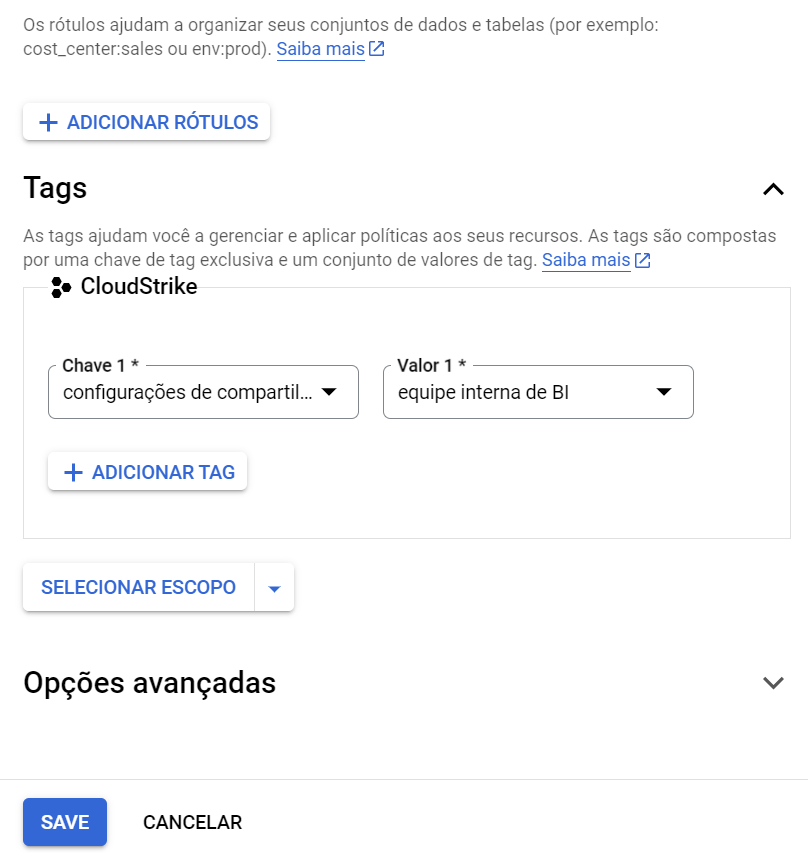
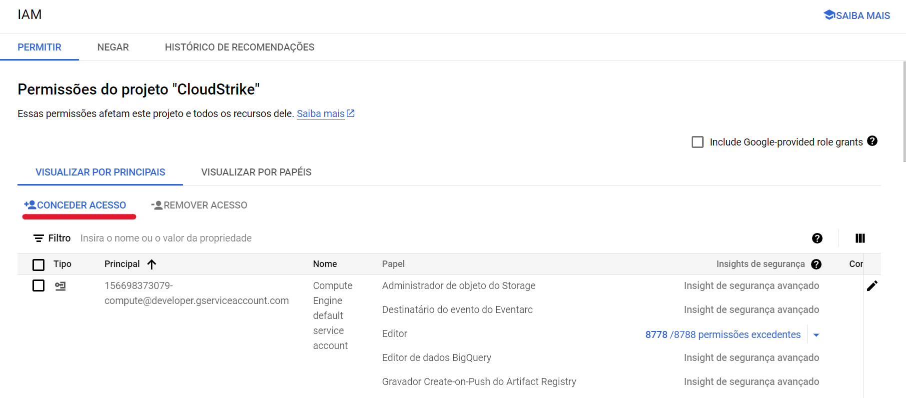
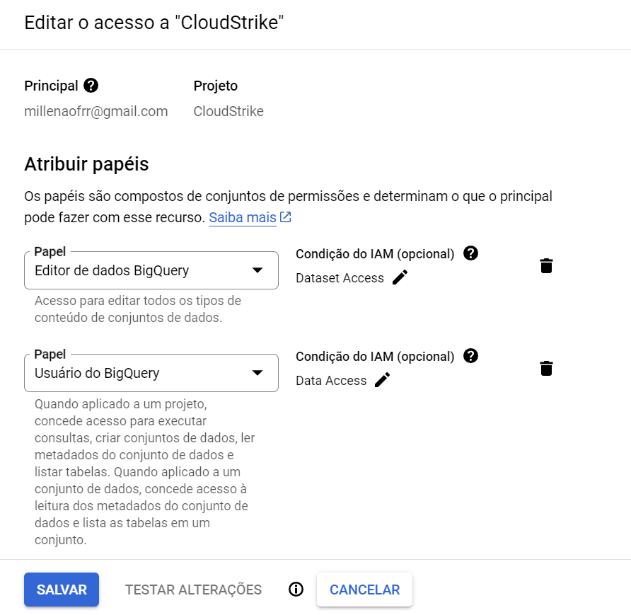
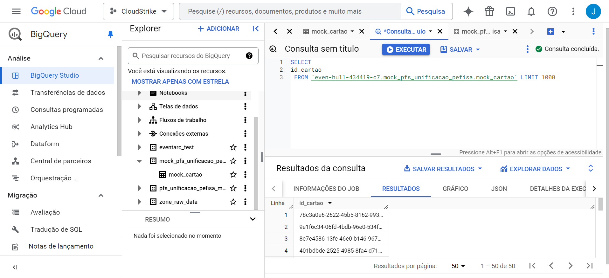
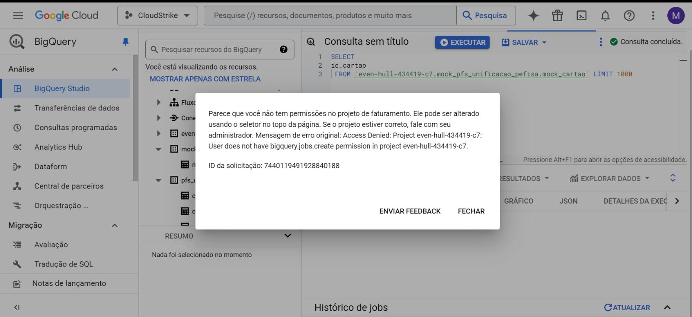

# Controle de Acesso no BigQuery usando Tags

## Introdução
Este documento descreve como configurar e gerenciar permissões de acesso a datasets no BigQuery usando **tags**, oferecendo uma maneira centralizada de controlar o acesso a diferentes recursos de dados dentro de um projeto.

## Passo a Passo

### 1. Criação de Tags
1. Acesse o **IAM & Admin** no GCP.
2. Selecione **Tags** no menu de administração.
3. Clique em **Criar tag** e defina a chave e valor:
   - **Exemplo:**
     - Chave = `data_sharing_settings`
     - Valor = `internal_bi_team`
---
**Imagem Exemplo**
---
**Criar tag**

---
**Defina a chave e valor**

### 2. Aplicação de Tags no Dataset
1. Acesse o **BigQuery** e navegue até o dataset desejado.
2. Selecione o dataset e clique em **Editar detalhes**.
3. Adicione a tag criada anteriormente.
4. Defina o escopo da tag como **Projeto atual**.
---
**Imagem Exemplo**
---
**Editar detalhes**

---
**Adicione a tag criada**

### 3. Concedendo Acesso a Usuários
1. No **IAM**, clique em **Conceder Acesso**.
2. Adicione o usuário desejado, por exemplo, `Tobias`.
3. Selecione a função, como **BigQuery Data Editor**.
4. Adicione uma condição de acesso:
   - Defina uma condição de recurso baseada na tag, como `data_set_access`.
   - Aplique a condição utilizando a tag e valor criados anteriormente (`internal_bi_team`).
---
   **Imagem Exemplo**
---
**Clique em conceder Acesso**

---
**Condição de acesso**

### 4. Testando o Acesso
1. Envie o link do dataset para o usuário e verifique se ele pode acessar os dados.
2. Se houver problemas, ajuste as permissões no IAM e aplique a condição ao papel correto (ex: tanto **Editor** quanto **Usuário**).
---
**Imagem Exemplo**
---
**Com permissão**

---
**Sem permissão**

## Conclusão
O uso de tags no BigQuery proporciona uma maneira eficiente de gerenciar permissões de acesso. Seguindo este passo a passo, você poderá controlar quem tem acesso aos seus datasets de forma centralizada, sem precisar configurar manualmente cada recurso individual.

